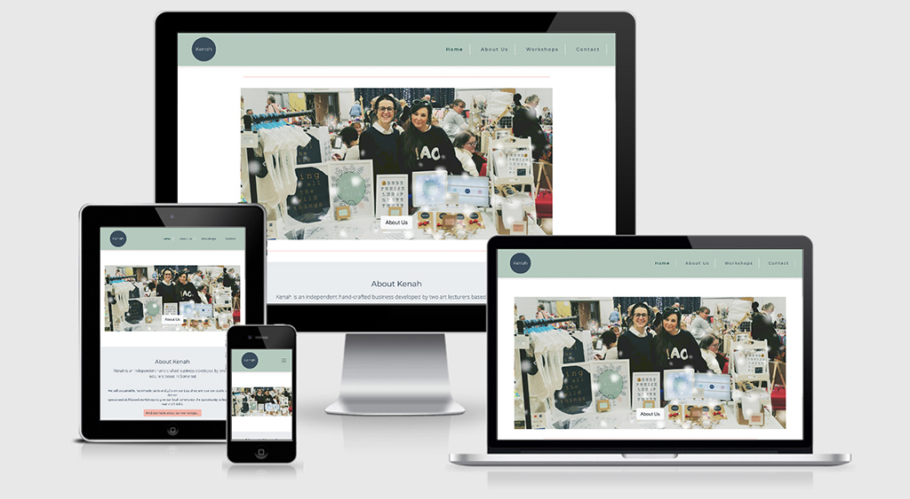
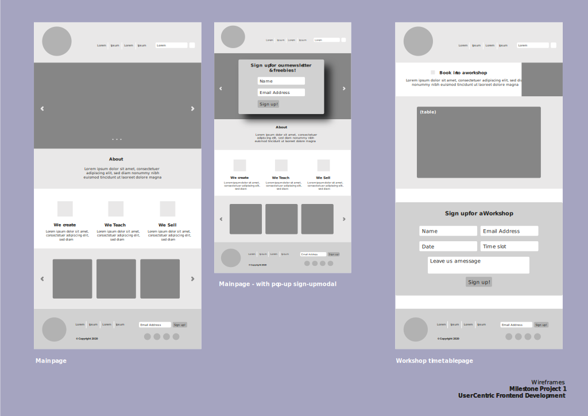
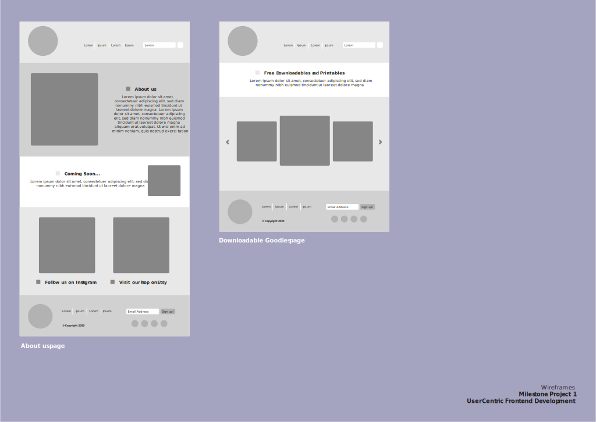
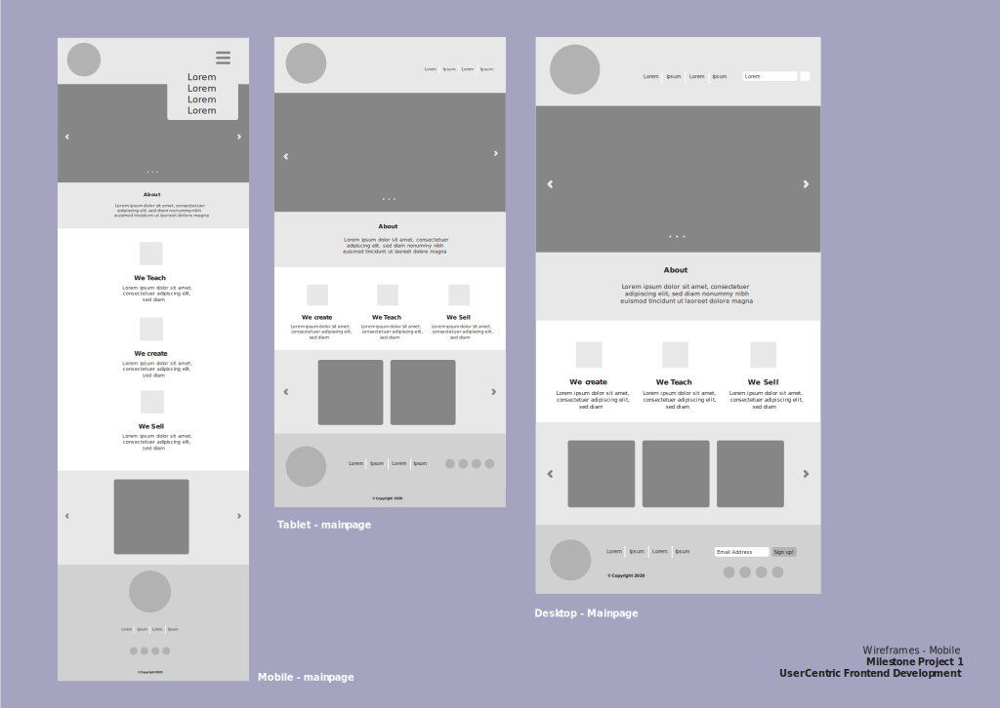
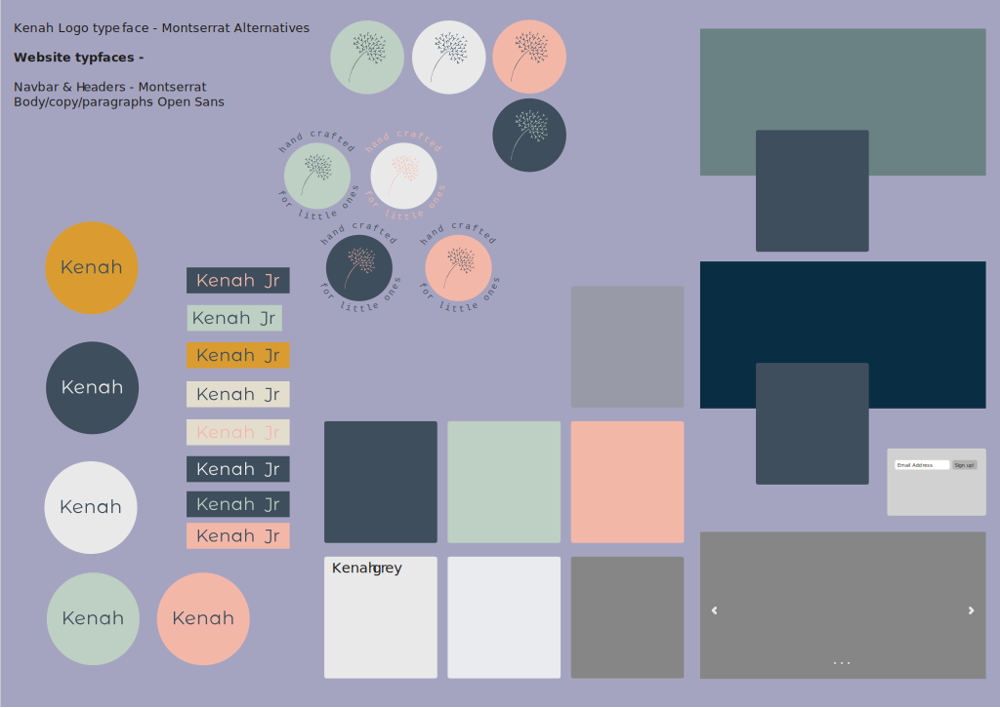
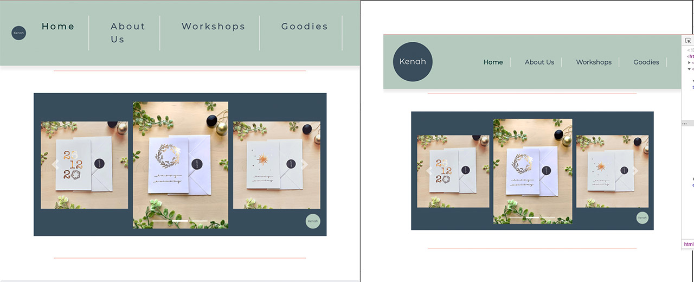
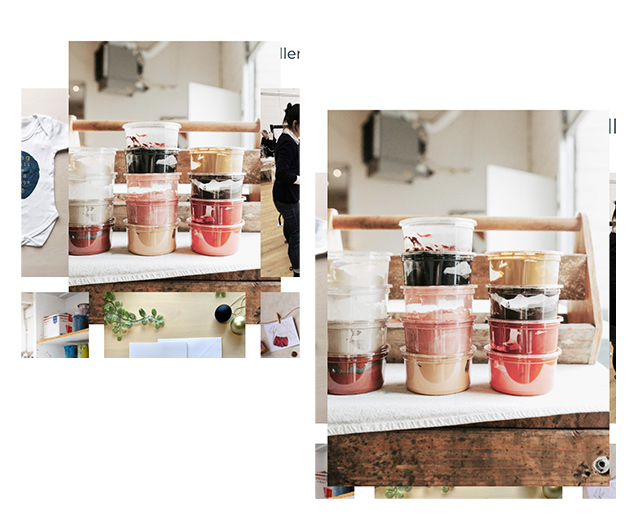

# Kenah

Kenah is a new independent business startup and personal side-business project started between two teachers, (myself and Jess Vickery) in it's early stages, aiming to sell their handmade / crafted deisgn, here is a link to their business is on [Etsy](https://www.etsy.com/uk/listing/901910909/pack-of-6-christmas-cards-handmade-with?ref=hp_rv-1). 
There is also a hyperthetical element added to the website, that the business are planning for the future, light-hearted skills workshops aimed at locals within the community that would enjoy learning new craft skills and art-based experiences.
As a brand new business and a part-tiem venture, at this point, the main target for the site is to:

# UX

#### Strategy (5 Planes of UX)

### Demographic
Kenah's demographic typically consists of a mainly female audience, aged approximately 25+. They are interested in craft, printing or art as a hobby, looking for a fun learning experience they can share with friends. They may also be professional designer, looking for potential studio space and facilities to rent within the loacl area of Somerset. 
A proportion of the target demographic are interested in purchasing from Kenah's Etsy shop and are likely to value unique, bespoke, personalised or authentic craft products with a consideration for sustainable, ethical or local production. Competitor sites they might use to search for products with a similar ethos include, [Etsy](https://www.etsy.com/uk/listing/901910909/pack-of-6-christmas-cards-handmade-with?ref=shop_home_active_1), [Not on the High Street](https://www.notonthehighstreet.com/) or [Made by Hand Online](https://madebyhandonline.com/).
The target audience is likely to be a working professional, willing to pay a higher price point than standard high street prices, placing value on the products handmade aspect, high quality and bespoke design, therefore, it is important that the client can identify personally with the brand. This can be achieved by including back-story behind the brand, including photography of the owners and their process and journey and creating a clean, professional site that is easy to navigate around with relevant social media links.
The technology they are most likely to use include mobile phones, tablets and social media sites (where they are more likely to look for brand advertising and updates), such as Facebook and Instagram, therefore, social media links should be easily accessible and the site must be responsive for all screen sizes.
### User Stories  
1. As a new visitor to the website, I want it to be informative, with clear navigation where I can easily access information about the brand and feel like I can make a personal connection.
2. As a new visitor to the website, I want to be able to find out what the brand is about and has to offer quickly and efficiently.
3. As a new or returning visitor to the website, I want a creative, calming and friendly experience.
4. As an interested visitor to the website, I want to find out if the site has an online shop and how to access this easily.
5. As a new visitor to the website, I want to find out what workshops are on offer, how much they cost and how to book them.
6. As a returning visitor, who has already booked in for a workshop, I want to be able to find the workshop timetable and contact page easily.
### Brand Owners
1. As Kenah is a newly started business, we would like an online presence that can showcase the brand with potential to build more features and develop in the future.
2. A clean, professional static platform that can inform Kenah's audience about our brand and ethos, what's available for them. 
3. The Kenah site should give easy access to contact us for more information and where to find us.
4. The Kenah site should clearly display information about our workshops and links to our Etsy online shop.
5. The Kenah site should feel like a professional but friendly experience with an element of calm and 'arty'.
#### Scope
Based on the information gathered in the 'strategy plane, the scope of this project should include, a responsive, functional, easy-to-navigate site across all platforms. It's feesable to suggest there's scope for an online shop built into the site, but this can be done in the future. 
Users will expect a high attention to detail and professional presentation of the site. Overcomplicated designs and functions are not necessary for this audience, they are more likely to appreciate a clean, simple but inviting site.
To invite customers to return, we could include a 'giveaway' or 'freebie' of some kind, such as a printable poster design, instructable or project, to be updated regularly. The site should include plenty of high-quality eye-catching imagery as many of the users inspired by visuals.
#### Structure
The strategy plane suggests that the user will want know more about the brand, find out what it has to offer, access contact details to get in touch and potentially buy from the Etsy store, therefore it would be wise to create pages based around the following areas with additional links following from one page to the next most relevant:
- contact details, opening times and 
- social media and Etsy shop links
- about us and our brand
- gallery with images displaying studio workshops, products, and owners 
- workshops, what types and pricing
- free printable / instructables
#### Skeleton
The Kenah brand has a circular logo design and the site should appear smooth and rounded, so I will consistently use circles and rounded edges throughout the site. 
The users will expect a calm, arty experience, therefore the colour palette should be muted or pastel. The site should also maintain sense of balance to promote a calm feeling and not too many different types of features. 
Consistency accross the site will be important to maintaining a good experience, therefore I may repeat some elements. 
#### Surface
Using research collected from the audience and brand, I started designing the wireframes with a clear vision of layout, typefaces, colour palette and features. I am interested in including:
- A clear navigation fixed to the top
- A pop-up modal upon entry to sign up
- An image carousel
- An expansion on 3 features about the brand, the shop, the workshops, we create
- An about us page
- A timetable of workshops
- Information about workshops and pricing
- A sign up form
- Free printable PDF's
- A callout to "what's coming soon..."
- A galley of rotating images
- Footer with social media links

### Wireframes

 

# Features
 
### (Existing features can be found under sub-heading below)
 

### Features Left to Implement
- In future, to develop the site and I'd like to include an online shop, embedded into the site.
- A blog page with links to social media posts and relevant articles for inspiration.
- Another feature I was unable to figure out how to embed was a lightbox to allow the gallery of photos to be enlarged and scrolled through.  
- Include functional booking forms for workshops, allowing for bookable timeslots and dates.
- A popup modal to allow for user sign-up and sign-up displayed in navbar.

# Technologies Used
(HTML & CSS)
[Bootstrap](https://getbootstrap.com/) I used the Bootstrap library for the majority of the site and a few of their icons. 
[Font Awesome](fontawesome.com) for social media icon use. 
[JQuery](https://jquery.com/) for activate image carousel.  
[Hover.css](https://ianlunn.github.io/Hover/) for css animations.  
[Adobe Illustrator](https://www.adobe.com/uk/) to create svg icons, wireframes and logo.  
[Adobe Photoshop](https://www.adobe.com/uk/) to edit all images.  
[W3C HTML](https://validator.w3.org/) [W3C CSS](http://www.css-validator.org/) to validate my HTML and CSS 

# Testing

## Existing Features and Functional Testing
#### index.html

| index.HTML             	| Expectation                                                                                                                                                                                                                                                                         	| Action                                                                                                                                                                                                                                                                                                                                                                                                                            	|
|------------------------	|-------------------------------------------------------------------------------------------------------------------------------------------------------------------------------------------------------------------------------------------------------------------------------------	|-----------------------------------------------------------------------------------------------------------------------------------------------------------------------------------------------------------------------------------------------------------------------------------------------------------------------------------------------------------------------------------------------------------------------------------	|
| **Navbar**             	| To achieve a similar effect to my wireframe. To stick to the top of the screen whilst scrolling. Logo floating left with home page link embedded and spaced out page links, floating right. Possibly a sign-up input, far right. Style with the brand colours.          	| Used Bootsrap navbar. Added dropdown burger icon menu for smaller screens, inspired by Code Institute. Added Bootstrap inline styling, mx/mr/my to space page links. Styled the bulk of navbar with CSS, including hover over page link colours, with help from [Medium](https://medium.com/wdstack/bootstrap-4-custom-navbar-1f6a2da5ed3c).  Added subtle drop shadow beneath the navbar, with a small bit of css code found on [stackoverflow](stackoverflow.com). 	|
| **Carousel**           	| To achieve 3 rotating images, accompanied with captions, a button, previous and next arrows and indication bars.                                                                                                                                                                    	| Used Bootsrap carousel with captions and added button into main image. Added images, styled button with the brand pink (this didn't work), and then bg-light, bg-light looked more professional.                                                                                                                                                                                                            	|
| **About Jumbotron**    	| To achieve a large span area with a clean spaced format for the introduction to the brand.                                                                                                                                                                                          	| Added Bootstrap jumbotron, styled with custom typefaces, colour.  Linked button to take the user to the 'about us' page and added brand info.                                                                                                                                                                                                                                                                   	|
| **3 Features Section** 	| A section to showcase the 3 main features of the brand with 3 images, explanations and icons.                                                                                                                                                                                       	| Wrapped 3 features in a section, added some inline and css styling. Added 3 Bootstrap icons.                                                                                                                                                                                                                                                         	|
| **Footer**             	| Logo floating left with home page link embedded.  Social media icons, smaller, floating to the left within circles. Content in between, either contact details / open times or the page links repeated. Possibly a sign-up input, far right. Styled with brand colours. 	| Used html footer and added styling.  Added the social media icons, styled inside circles (to match brand aesthetic), with brand colours for background and hover. Added email, address and open times. Tried to adding 2 short vertical lines (border-right: 1px solid), as dividers between the address/open times. Added media query to set margins for logo at extra-small breakpoint.              	|

#### Problem solving, Bugs and Fixes on index.html

- Navbar  
Learning how to customise Bootsrap default navbar with colour. After research, I found a useful site, Medium, I took some of the classes in this to style my navbar, (navbar-custom).
Making the navbar responsive was a challenge. As the screen was minimising, the logo was shrinking and the text dropped down. To solve this, I checked it at each breakpoint and added a media query, changing the font-size and letter-spacing before the dropdown menu kicked in.
  

- Carousel  
I initially missed out the carousel script that was required to make the carousel function. I took a while researching into this before I spoke to a Code Institute tutor who helped me find the script on the Bootrap site.
I hadn't learnt enough about images at this point and I would like to refine the quality of these in the future.
Due to the nature of the images I had chosen, the captions didn't work, so I removed them from the design.
I'm not happy with the prev/next arrow button colour, it's not visible enough. This is something I didn't have time to fix but would like to look into in future.
- 3 Features  
The images were too large in the first instance, with the three spanning the width of the page. This didn't look good so I added some inline styling to decrease the width of the section. 
The section wasn't responsive, and after speaking to my Mentor, Dick, I decided to add columns to solve this. The columns worked but it caused the row of three to become an awkward shape. To solve this, I added col-md-12 to the final image to occupy the width of the bottom row. Whilst this looks better, I am not happy with it resolution of the image at this size, this is something I would like to go back and correct.
- Footer  
I used columns to make the footer responsive, after struggling for a while with a media query. I couldn't style the elements I was selecting, the address/open times, in the media query, I'm not sure why although I spent a lot time researching. The columns work fine and the footer is responsive, but it doesn't center-align at the mobile screen size, which is something I'd like to achieve in future.
I also found the 2 short vertical lines (border-right: 1px solid) to unpredictable to work with at smaller screen sizes so I removed them to save time. 

#### about.html

| about.HTML    	| Expectation                                                                                                                                                                                    	| Action                                                                                                                                                                                  	|
|---------------	|------------------------------------------------------------------------------------------------------------------------------------------------------------------------------------------------	|-----------------------------------------------------------------------------------------------------------------------------------------------------------------------------------------	|
| **Jumbotron** 	| To achieve a large span area with a clean spaced format consistent with main page. To add more detailed info about brand journey. To add circular image consistent with brand aesthetic. 	| Added Bootstrap jumbotron, styled consistently with main page.  Added circular image, styled in css. Linked button to take the user to the 'workshops' page and added brand info. 	|
| **Gallery**   	| To add a 12-image gallery with scroll-through lightbox.                                                                                                                                        	| Added 12-image gallery with hover:zoom effect.                                                                                                                                          	|

#### Problem solving, Bugs and Fixes on about.html

- Gallery  
The scroll-through gallery with lightbox I had envisioned was not viable after hefty research on [MDBootstrap](https://mdbootstrap.com/plugins/jquery/gallery/) and various other sites. I realised I didn't have enough Javascript knowledge to achieve this.
I settled on a more simple but effective hover:zoom effect. Once all images were in, the zoom effect did not work how expected, it zoomes images to underlap beneath others. 
I fixed this with help from [stackoverflow](https://stackoverflow.com/questions/18600789/hover-image-enlarge-using-css-in-front-of-other-images), styling the image zoom with a z-index on my CSS.
  

#### workshops.html

| workshops.HTML           	| Expectation                                                                                                           	| Action                                                                                                                                               	|
|--------------------------	|-----------------------------------------------------------------------------------------------------------------------	|------------------------------------------------------------------------------------------------------------------------------------------------------	|
| **Workshop info cards**  	| To achieve a span of 4 cards. To add more detailed info about workshops and prices. To add accompanying images. 	| Added 4 Bootstrap cards, mainly all inline styles. Added images.  Later added columns to make them responsive.                                 	|
| **Timetable**            	| To add a succinct timetable with clear layout and icons within brand aesthetic.                                       	| Added Bootstrap striped table.  Used CSS to style all colour, type and added an opacity. Created SVG's on Illustrator and embedded into table. Added a subtle shadow table in CSS. 	|
| **Contact link section** 	| A small section leading user to contact page so they can book in.                                                     	| Added section with header, text. Added button linking to 'contact' page and styled consistently with jumbotron buttons.                           	|

#### Problem solving, Bugs and Fixes on workshops.html

- Timetable  
The timetable was relatively straight forward to create but I wanted to overlay the original striped background with transparent 'brand' pink. When I tried this in the CSS, it covered the whole table. 
I then needed to find code to prevent the type and icons being overlayed. I found some code that solved this on [Stackoverflow](https://stackoverflow.com/questions/21743753/style-table-to-have-transparent-background-with-opaque-text) and adjusted the css styles and opacity to suite the brand aethestic.

#### contact.html

| contact.HTML     	| Expectation                                                                                                                               	| Action                                                                                                                                                                                                                                                                	|
|------------------	|-------------------------------------------------------------------------------------------------------------------------------------------	|-----------------------------------------------------------------------------------------------------------------------------------------------------------------------------------------------------------------------------------------------------------------------	|
| **Contact form** 	| To create a simple contact form capturing name, email address and open enquiry. To add a response confirming form entry was a success. 	| Added simple html form with name, email and text area for open enquiry. Added a media query to shrink form down on smaller screen sizes.                                                                                                                           	|
| **Fun Freebies** 	| To create a small suprise area where users can access and download free PDF's linking to the workshops.                                   	| Added explanatory text styled consistently with jumbotrons and overall site theme. Used Bootstrap's 'download' icon and added hover styling to match social media icons. Linked icons to 2 'fun/instructable' PDF's, set target="_blank" to open in new window. 	|

#### Problem solving, Bugs and Fixes on contact.html

- Contact form  
The contact form, it's styling and  media query went very well. Once I completed them I started researching into how to validate the user with a response. I found a lot of information on Bootstrap regarding this but I didn't feel confident to use it and was running low on time. This is a feature I would have liked to add to the contact page and will learn in the future.

### Browser & Responsiveness Testing
- Safari - The site works successfully in Safari, however the format of the page is slightly different, the appearance of the logo slightly smaller than I like.
- Chrome - The site works successfully across each page, with no missing links or visible errors.
- [Am I Responsive](http://ami.responsivedesign.is/#) - The site is responsive across all media sizes. Upon review and reflection, the site could be more mobile ready, some margins/padding/resizing could further imporve mobile UX. 

### User Story Testing
Refering back to the user stories, these needs have almost completely been met;

1. I believe a new visitor would be able to access the information they needed immediatley by accessing 'about us' link in nvabar or scrolling down to jumbotron on main page which has a button like to 'about us'. On the 'About Us' page, a paragraphs explain the journey of the brand with an image of the owners, allowing for a personal connection to form.
2. A new customer can easily navigate through the simple navbar to find out everything the brand has to offer.
3. The experience created upon entering the site is balanced, with line breaks to break up sections clearly, plenty of negative / white space for clarity and a calm colour theme with circular shapes and round edges, overall giving a calming expereince.
4. The Etsy shop could have been more clearly sign-posted, e.g. a shopping icon could be added and floated to the right. However there are 2 Etsy links on the main page and in the footers.
5. The workshops times and pricing are clear and easy to loacte.
6. The contact page is clearly stated in the navbar.

The buttons on each page act as guide through the site, from one-page to another. 

### Validator Testing
I used [W3C HTML](https://validator.w3.org/) to validate my HTML and [W3C CSS](http://www.css-validator.org/) at the end of the project.
When validating my code, the html validator found 5 errors and 1 warning. These were all found on the index.html:
1. Stray footer tag.
2. Stray script tag.
3. Inline width:100% style unecessarily placed on logo in html.
4. An aria attribute on the dropdown toggle was alllowed.
5. An anchor element link should not contain a button - this was found on my carousel. 
6. I was warned that a header should be added inside section at the top.

#### Actions I took to resolve these:
1. Placed the body tag after the footer and the script tags. 
2. (same as above)
3. deleted the unecessary inline width style, then I tested the affects, nothing changed.
4. Removed the aria attribute to the dropdown toggle.
5. I added an anchor, gave it a class of btn and role of button. Upon re-testing, this worked well. 
6. Upon doing research, I found it was not necessary to have a header in the section and that this could be left the way it is. 
 **After resolving these issues, I ran: about.html, workshops.html, contact.html and style.css through the validator and none of the pages had any code errors.** 

## Deployment
This section should describe the process you went through to deploy the project to a hosting platform (e.g. GitHub Pages or Heroku).
In particular, you should provide all details of the differences between the deployed version and the development version, if any, including:
- Different values for environment variables (Heroku Config Vars)?
- Different configuration files?
- Separate git branch?

In addition, if it is not obvious, you should also describe how to run your code locally.
## Credits
- [Medium](https://medium.com/wdstack/bootstrap-4-custom-navbar-1f6a2da5ed3c) helped me learn to customise my navbar, from this research, I used the navbar-custom class. 
- [Stack Overflow](stackoverflow.com) is a site I regularly revisted with questions if code wasn't behaving how I wanted. This was a really useful resource!
- [Slack](slack.com) was an excellent resource which I regularly used. Occasionally if I was having trouble with code, I'd post it on the forum, but I mainly used this to search for problems which people have had in the past, I usually always found answers.
- [System 22 I.T. Solutions](https://www.youtube.com/channel/UCYeyetu9B2QYrHAjJ5umN1Q) I watched many of their videos on You Tube, to gain inspiration for many elements of the project.
- [W3Schools](www.w3schools.com) I used this site to test snippets of code and for research
- [Kevin Powell](https://www.kevinpowell.co/) I watched many of his videos to gain inspiration.
### Content
- All comercial content, colour theme, logo design and branding for the site written and designed by myself, (Roxanne Boulden) and Jessica Vickery, the brand owners.
- The downloadable PDF's, located in assets/images/ were all created by myself, using Adobe InDesign.
- All SVG's (icons and logo), located in assets/images/ were all created by myself, using Adobe Illustrator.
- [Bootstrap Icons](https://icons.getbootstrap.com/), I used some of Bootstraps icons on the main page of my site.
- [Font Awesome](fontawesome.com), I used font awesome's icons for my social media links.
### Media
The photography used in this site are from two different sources.
- Kenah's photos, taken and edited in Adobe Photoshop by myself and Jess Vickery.
- [Unsplash](https://unsplash.com/) A free online resource of professional stock photos. I used a selection of these to infill in between Kenah's images to add variation and a more sophisticated finish.
### Acknowledgements
**Inspiration and research**
- [Archer & Olive](archerandolive.com) inspiration taken from site layout.
- [Photografica](https://www.photografica.com.au/image-size-resolution-and-resizing-images-for-the-web/) has a great blog article that helped me understand how to correctly size and format my images in Photoshop. 
